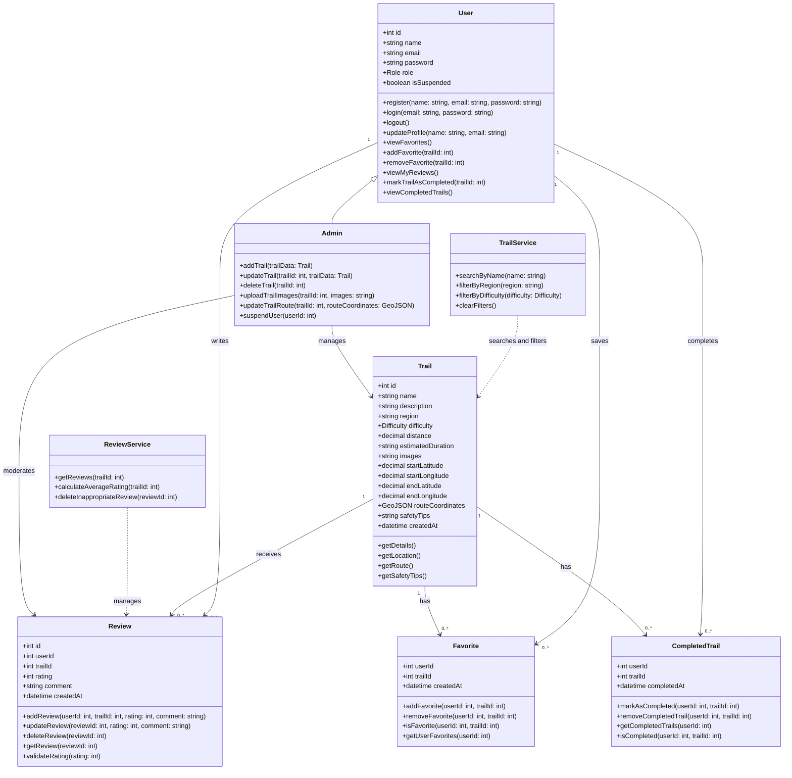
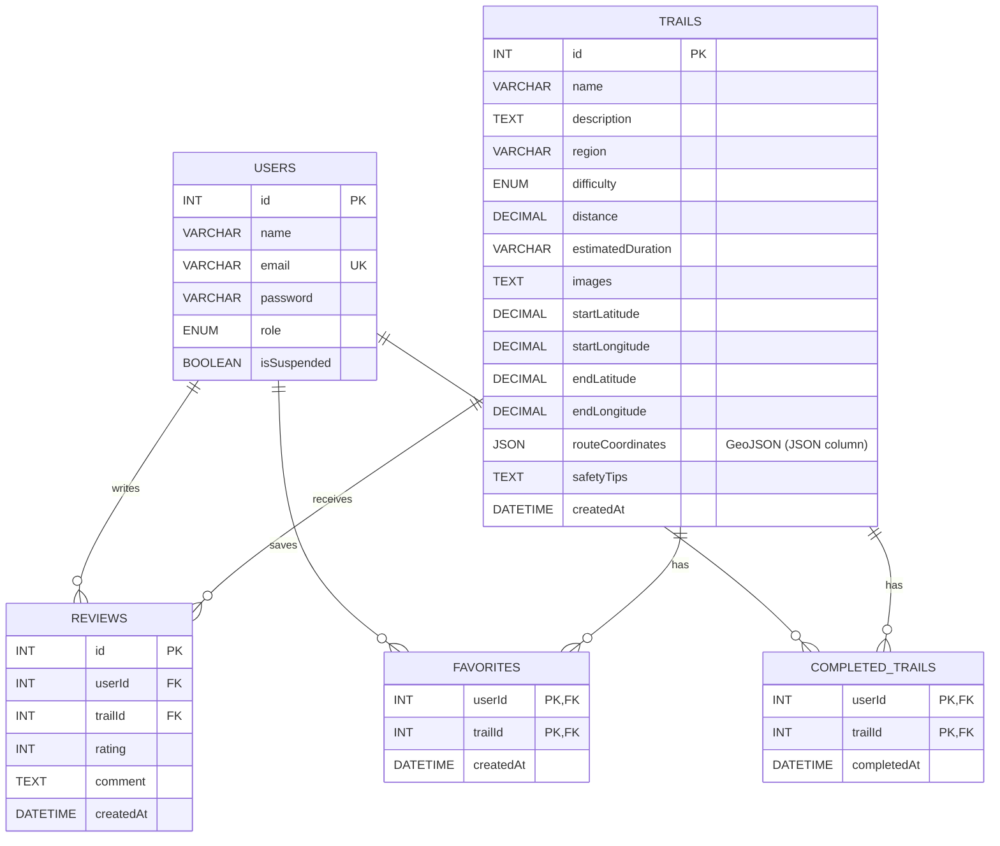

# Components, Classes, and Database Design

## 1. Back-end Classes

### User

**Attributes:**

* `id`
* `name`
* `email`
* `password`
* `role`
* `isSuspended`

**Methods:**

* `register(name, email, password)`
* `login(email, password)`
* `logout()`
* `updateProfile(name, email)`
* `viewFavorites()`
* `addFavorite(trailId)`
* `removeFavorite(trailId)`
* `viewMyReviews()`
* `markTrailAsCompleted(trailId)`
* `viewCompletedTrails()`

### Trail

**Attributes:**

* `id`
* `name`
* `description`
* `region`
* `difficulty`
* `distance`
* `estimatedDuration`
* `images`
* `startLatitude`
* `startLongitude`
* `endLatitude`
* `endLongitude`
* `routeCoordinates` (GeoJSON)
* `safetyTips`
* `createdAt`

**Methods:**

* `getDetails()`
* `getLocation()`
* `getRoute()`
* `getSafetyTips()`

### Review

**Attributes:**

* `id`
* `userId`
* `trailId`
* `rating`
* `comment`
* `createdAt`

**Methods:**

* `addReview(userId, trailId, rating, comment)`
* `updateReview(reviewId, rating, comment)`
* `deleteReview(reviewId)`
* `getReview(reviewId)`
* `validateRating(rating)`

### Favorite

**Attributes:**

* `userId`
* `trailId`
* `createdAt`

**Methods:**

* `addFavorite(userId, trailId)`
* `removeFavorite(userId, trailId)`
* `isFavorite(userId, trailId)`
* `getUserFavorites(userId)`

### CompletedTrail

**Attributes:**

* `userId`
* `trailId`
* `completedAt`

**Methods:**

* `markAsCompleted(userId, trailId)`
* `removeCompletedTrail(userId, trailId)`
* `getCompletedTrails(userId)`
* `isCompleted(userId, trailId)`

### TrailService

**Attributes:**

* None

**Methods:**

* `searchByName(name)`
* `filterByRegion(region)`
* `filterByDifficulty(difficulty)`
* `clearFilters()`

### ReviewService

**Attributes:**

* None

**Methods:**

* `getReviews(trailId)`
* `calculateAverageRating(trailId)`
* `deleteInappropriateReview(reviewId)`

### Admin

Admin inherits from the `User` class and provides additional administrative functions.

**Methods:**

* `addTrail(trailData)`
* `updateTrail(trailId, trailData)`
* `deleteTrail(trailId)`
* `uploadTrailImages(trailId, images)`
* `updateTrailRoute(trailId, routeCoordinates)`
* `suspendUser(userId)`

---

# 2. UML Class Diagram

---

# 3. Database Design

The system uses a relational MySQL database with the following tables. Trail routes are stored as GeoJSON in a JSON column.

### Users

| Field       | Type    | Key    |
| ----------- | ------- | ------ |
| id          | INT     | PK     |
| name        | VARCHAR |        |
| email       | VARCHAR | UNIQUE |
| password    | VARCHAR |        |
| role        | ENUM    |        |
| isSuspended | BOOLEAN |        |

### Trails

| Field             | Type                  | Key |
| ----------------- | --------------------- | --- |
| id                | INT                   | PK  |
| name              | VARCHAR               |     |
| description       | TEXT                  |     |
| region            | VARCHAR               |     |
| difficulty        | ENUM                  |     |
| distance          | DECIMAL               |     |
| estimatedDuration | VARCHAR               |     |
| images            | TEXT                  |     |
| startLatitude     | DECIMAL               |     |
| startLongitude    | DECIMAL               |     |
| endLatitude       | DECIMAL               |     |
| endLongitude      | DECIMAL               |     |
| routeCoordinates  | GeoJSON (JSON column) |     |
| safetyTips        | TEXT                  |     |
| createdAt         | DATETIME              |     |

### Reviews

| Field     | Type     | Key            |
| --------- | -------- | -------------- |
| id        | INT      | PK             |
| userId    | INT      | FK → Users.id  |
| trailId   | INT      | FK → Trails.id |
| rating    | INT      |                |
| comment   | TEXT     |                |
| createdAt | DATETIME |                |

### Favorites

| Field     | Type     | Key                |
| --------- | -------- | ------------------ |
| userId    | INT      | PK, FK → Users.id  |
| trailId   | INT      | PK, FK → Trails.id |
| createdAt | DATETIME |                    |

### CompletedTrails

| Field       | Type     | Key                |
| ----------- | -------- | ------------------ |
| userId      | INT      | PK, FK → Users.id  |
| trailId     | INT      | PK, FK → Trails.id |
| completedAt | DATETIME |                    |

---

# 4. ER Diagram

---

# 5. Front-end Components

The main front-end components are:

* **Home / Trail List**

  * Displays available hiking trails to guests and registered users.
  * Provides access to search and filters.

* **Search Bar**

  * Searches trails by name.

* **Filter Component**

  * Filters trails by region.
  * Filters trails by difficulty.

* **Trail Details**

  * Displays trail description, region, difficulty, distance, duration, images, and safety tips.

* **Trail Map**

  * Displays the trail starting point.
  * Displays the trail route (GeoJSON) with start and end points.
  * Displays the user's current location on the trail map with periodic updates while hiking.

* **Authentication**

  * Registration.
  * Login.
  * Logout.
  * Prompts guests to sign up when they try to save, rate, or review a trail.

* **Profile**

  * Allows registered users to edit their account information.

* **Favorites**

  * Allows registered users to save and remove favorite trails.

* **Reviews & Ratings**

  * Displays reviews and average ratings.
  * Allows registered users to submit ratings and comments.
  * Allows users to edit or delete their own reviews.

* **Completed Trails**

  * Allows registered users to mark trails as completed.
  * Displays the user's list of completed trails.

* **Admin Panel (In-App)**

  * Available inside the same app and shown only to users with the admin role.
  * Allows admins to add, edit, and delete trails.
  * Allows admins to delete inappropriate reviews.
  * Allows admins to suspend users.
